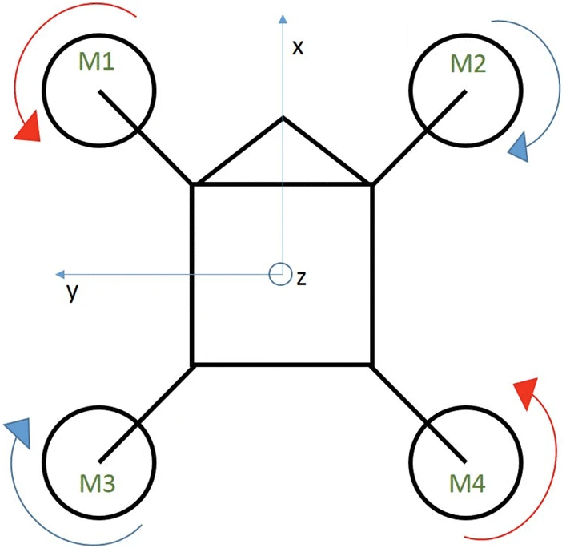

# Connection Guide

This brief connection guide explains how to connect the wiring for all all the hardware components to the
Beaglebone Blue embedded computer. This includes:

1. The Electronic Speed Controllers (ESCs)
2. The [DSM Remote Receiver](https://www.spektrumrc.com/Products/Default.aspx?ProdID=SPM9645)
3. *Optional:* The Mission Computer

## ESCs

The Electronic speed controllers get connected to the first four slots of the "8 servo motor outputs"
(see diagram below). These slots are labelled with very small lettering below the ports, you'll see that servo output 1
is on the left-most side of the device. Make sure to connect the corresponding output to the associated ESC/motor as
shown in the diagram below.

## DSM Remote Receiver

Connecting the DSM remote receiver is quite simple. It connects to the port labelled UART (DSM) on the figure below.
This is the only I/O port that fits the 3-wire **JST ZHR-3** connector that is shipped with the DSM Remote Receiver

## Mission Computer

The *Optional* mission computer computer connects to UART5, which is the I/O port directly above the DSM port. This
port is intended to be used to send navigation feedback and trajectory commands via serialized mavlink messages.

## Beaglebone Blue I/O Ports

