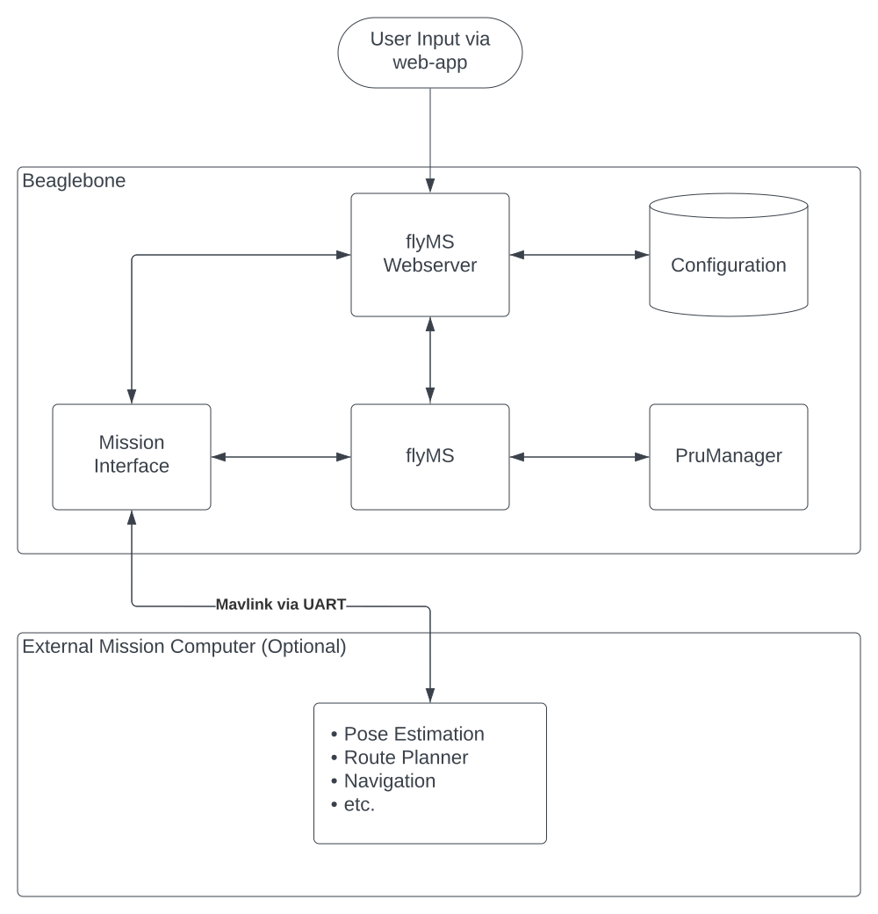

# Process Diagram

## Process Descriptions:

* **flyMS Webserver** - Serves HTML web app on port 5000. Edits the flight configuration file with user's input, and
forwards it to the flyMS flight program when requested. It also sends/receives custom commands from external hardware
* **Mission Interface** - Interface between the mission computer and the flight controller. Messages are passed via UART,
and serialized as mavlink messages
* **flyMS** - Main flight controller, executes the inner/outer control loops for the drone. It gets configuration
parameters from the flyMS webserver, permission to use the PRU from the PruManager, and optionally pose estimates
from the mission interface
